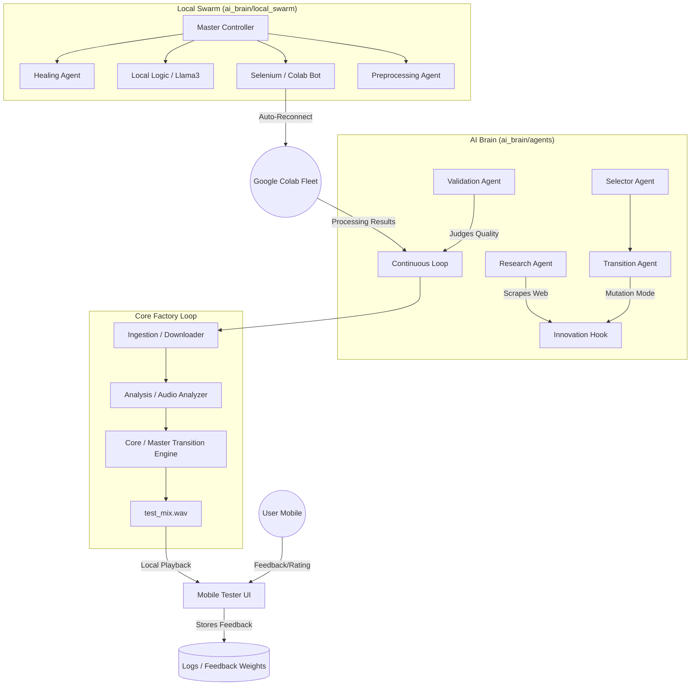

# 🦖 AI DJ Autonomous Pipeline - Architecture Diagram

This document outlines the system design and data flow for the Autonomous AI DJ Testing & Innovation Pipeline.

## 🏗️ System Overview

## 🧩 Components

### 1. Local Swarm (`ai_brain/local_swarm/`) - **CREDIT SAVERS**
- **Master Controller**: Manages the lifecycle of all local bots.
- **Selenium Bot**: Automates Colab re-connections, cell-starts, and Drive approvals.
- **Local Logic (Llama3)**: Handles semantic reasoning and thematic bridges locally via Ollama.
- **Healing Agent**: Automatically fixes code crashes, missing dirs, and dependency issues.
- **Preprocessing Agent**: Background audio analysis using `librosa` to speed up the main loop.

### 2. AI Brain (`ai_brain/agents/`)
- **Transition Agent**: Decides horizontal/vertical mix logic.
- **Research Agent**: Scours the web for new DJ techniques.
- **Validation Agent**: Pre-screens mixes using signal analysis.

### 3. Core Factory
- **Downloader**: Fetches stems and high-quality audio.
- **Analyzer**: Extracts BPM, Key, Energy, and Melodic phrases.
- **Master Engine**: Executes high-fidelity transitions (CSPI, Wordplay Mashups, Echo Out).

### 4. Remote Feedback (`mobile_tester.py`)
- **Pro Interface**: 60s action-slice playback with binary ratings.
- **Public Access**: Tunneled via Cloudflare for remote testing from your phone.

## 🔄 Status & Versioning
- **Git Repo**: [parth33320/DJ](https://github.com/parth33320/DJ)
- **Primary Branch**: `master`
- **Automation**: `local_git_agent` handles automated innovation backups.
