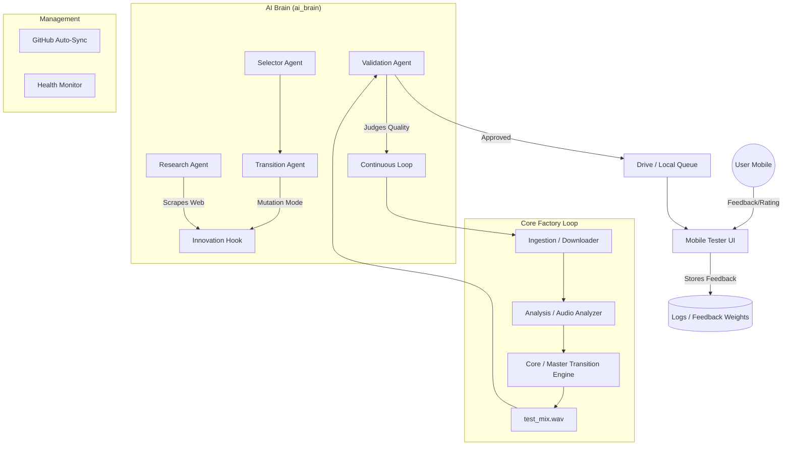

# 🦖 AI DJ Autonomous Pipeline - Architecture Diagram

This document outlines the system design and data flow for the Autonomous AI DJ Testing & Innovation Pipeline.

## 🏗️ System Overview

## 🧩 Components

### 1. AI Brain (`ai_brain/agents/`)
- **Transition Agent**: Decides horizontal/vertical mix logic.
- **Research Agent**: Scours the web for new DJ techniques.
- **Validation Agent**: Pre-screens mixes using signal analysis and @BestDJTransitions data.

### 2. Core Factory
- **Downloader**: Fetches stems and high-quality audio.
- **Analyzer**: Extracts BPM, Key, Energy, and Melodic phrases (optimized 180s load).
- **Master Engine**: Executes high-fidelity transitions (Half-time, Double-time, etc.).

### 3. Mobile UI (`mobile_tester.py`)
- **Pro Interface**: 60s action-slice playback.
- **Feedback Loop**: Collects binary ratings and text-based suggestions for Agent learning.
- **Public Access**: Tunneled via Cloudflare for remote testing.

## 🔄 Data Sync
- **GitHub**: Automated push on every significant system fix.
- **Google Drive**: Continuous queueing of validated transition test-packs.
- **NTFY**: Real-time push notifications of generation status.
